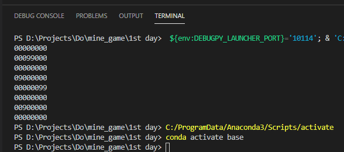

# 첫 번 째 날 - 지뢰 표시하기

| Tables        | Are           | Cool  |
| ------------- |:-------------:| -----:|
| col 3 is      | right-aligned | $1600 |
| col 2 is      | centered      |   $12 |
| zebra stripes | are neat      |    $1 |

* col3 ㅇㅇㅇ
* ㅇㅇㅇ
  * ㅇㅇㅇ



[참고했던 자료](http://10bun.tv/beginner/episode-2/)

## 첫 번 째 날 - 지뢰 표시하기

### 첫 번 째 날 - 지뢰 표시하기

#### 첫 번 째 날 - 지뢰 표시하기


> 참고로 위의 소스는 어쩌고 저쩌고
> 그렇게 하세요

``` python
# 정해진 개수만큼 지뢰 만들기

import random

MINE_WIDTH  = 8
MINE_HEIGHT = 8
MINE_COUNT = 6

mines = [
    [0, 0, 0, 0, 0, 0, 0, 0],
    [0, 0, 0, 0, 0, 0, 0, 0],
    [0, 0, 0, 0, 0, 0, 0, 0],
    [0, 0, 0, 0, 0, 0, 0, 0],
    [0, 0, 0, 0, 0, 0, 0, 0],
    [0, 0, 0, 0, 0, 0, 0, 0],
    [0, 0, 0, 0, 0, 0, 0, 0],
    [0, 0, 0, 0, 0, 0, 0, 0]
]

def show_mines():
    for y in range(MINE_HEIGHT):
        for x in range(MINE_WIDTH):
            print(mines[y][x], end="")
        print("")

def make_mines(size):
    count = 0
    while True:
        x = random.randint(0, 7)
        y = random.randint(0, 7)
        if mines[y][x] != 9:
            mines[y][x]= 9
            count = count + 1
            if count >= size:
                break

make_mines(MINE_COUNT)
show_mines()
```