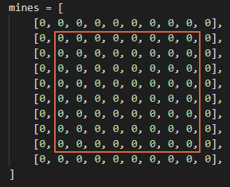

# 첫 번 째 날 - 지뢰 표시하기

## 개요

지뢰찾기 게임을 만들기 위해서 우선 지뢰를 표시하는 방법에 대해서 연구해봤다.
* 배열의 숫자가 9이면 지뢰이다.
* 배열의 숫자가 9와 0이 아니면 주변에 있는 지뢰의 개수이다.

## 첫 번 째 시도

정해진 개수만큼 지뢰를 배열에 표시하는 방법을 구현한 것이다.

``` python
import random

MINE_WIDTH  = 8
MINE_HEIGHT = 8
MINE_COUNT = 6

mines = [
    [0, 0, 0, 0, 0, 0, 0, 0],
    [0, 0, 0, 0, 0, 0, 0, 0],
    [0, 0, 0, 0, 0, 0, 0, 0],
    [0, 0, 0, 0, 0, 0, 0, 0],
    [0, 0, 0, 0, 0, 0, 0, 0],
    [0, 0, 0, 0, 0, 0, 0, 0],
    [0, 0, 0, 0, 0, 0, 0, 0],
    [0, 0, 0, 0, 0, 0, 0, 0]
]

# 지뢰들을 화면에 표시하는 함수 
def show_mines():
    for y in range(MINE_HEIGHT):
        for x in range(MINE_WIDTH):
            print(mines[y][x], end="")
        print("")

# 랜덤으로 지뢰의 위치를 정하는 함수
def make_mines(size):
    count = 0
    while True:
        x = random.randint(0, 7)
        y = random.randint(0, 7)

        # 해당 위치에 지뢰가 없을 경우에만 생성한다
        if mines[y][x] != 9:
            mines[y][x]= 9
            count = count + 1
            if count >= size:
                break

make_mines(MINE_COUNT)
show_mines()
```


## 두 번 째 시도

주변에 지뢰가 몇개 있는지 알려주는 소스이다.

``` python
import random

MINE_WIDTH  = 8
MINE_HEIGHT = 8
MINE_COUNT = 6

mines = [
    [0, 0, 0, 0, 0, 0, 0, 0],
    [0, 0, 0, 0, 0, 0, 0, 0],
    [0, 0, 0, 0, 0, 0, 0, 0],
    [0, 0, 0, 0, 0, 0, 0, 0],
    [0, 0, 0, 0, 0, 0, 0, 0],
    [0, 0, 0, 0, 0, 0, 0, 0],
    [0, 0, 0, 0, 0, 0, 0, 0],
    [0, 0, 0, 0, 0, 0, 0, 0]
]

def show_mines():
    for y in range(MINE_HEIGHT):
        for x in range(MINE_WIDTH):
            print(mines[y][x], end="")
        print("")

def make_mines(size):
    count = 0
    while True:
        x = random.randint(0, 7)
        y = random.randint(0, 7)
        if mines[y][x] != 9:
            mines[y][x]= 9
            count = count + 1
            if count >= size:
                break

# 주변에 지뢰가 몇개 있는지 표시하는 함수
def count_mines():
    for y in range(MINE_HEIGHT):
        for x in range(MINE_WIDTH):
            if mines[y][x] == 9:

                # 자신 위치에서 팔방의 모든 칸을 검색한다
                for i in range(-1,2):
                    for j in range(-1,2):
                        # 좌표가 범위를 벗어나는지 확인
                        if (0 <= y+i) and y+i <= 7:
                            if (0 <= x+j) and x+j <= 7:
                                if mines[y+i][x+j] != 9:
                                    mines[y+i][x+j] = mines[y+i][x+j] + 1

make_mines(MINE_COUNT)
count_mines()
show_mines()
```

## 세 번 째 시도

반복문 대신 좌표를 집적 입력해 작성한 소스.

``` python
import random

MINE_WIDTH  = 8
MINE_HEIGHT = 8
MINE_COUNT = 6

mines = [
    [0, 0, 0, 0, 0, 0, 0, 0],
    [0, 0, 0, 0, 0, 0, 0, 0],
    [0, 0, 0, 0, 0, 0, 0, 0],
    [0, 0, 0, 0, 0, 0, 0, 0],
    [0, 0, 0, 0, 0, 0, 0, 0],
    [0, 0, 0, 0, 0, 0, 0, 0],
    [0, 0, 0, 0, 0, 0, 0, 0],
    [0, 0, 0, 0, 0, 0, 0, 0]
]

def show_mines():
    for y in range(MINE_HEIGHT):
        for x in range(MINE_WIDTH):
            print(mines[y][x], end="")
        print("")

def make_mines(size):
    count = 0
    while True:
        x = random.randint(0, 7)
        y = random.randint(0, 7)
        if mines[y][x] != 9:
            mines[y][x]= 9
            count = count + 1
            if count >= size:
                break

# 해당 좌표에 지뢰가 있는 지 확인하는 함수
# 좌표에서 벗어나는 지 확인하는 것을 함께처리했다.
def check_mine(x, y):
    return (x in range(MINE_WIDTH)) and (y in range(MINE_HEIGHT)) and (mines[y][x] == 9)

def count_mines():
    for y in range(MINE_HEIGHT):
        for x in range(MINE_WIDTH):

            # 반복문 대신 직접 좌표를 입력해 검색
            # 좌표가 범위를 벗어나는 지 함수 내부에서 처리하고 있어서
            # 개수를 세는데 중요하지 않은 문제를 신경쓰지 않아도 된다.
            if mines[y][x] != 9:
                if check_mine(x+1, y): mines[y][x] = mines[y][x] +1
                if check_mine(x-1, y): mines[y][x] = mines[y][x] +1
                if check_mine(x, y+1): mines[y][x] = mines[y][x] +1
                if check_mine(x, y-1): mines[y][x] = mines[y][x] +1
                if check_mine(x+1, y+1): mines[y][x] = mines[y][x] +1
                if check_mine(x-1, y+1): mines[y][x] = mines[y][x] +1
                if check_mine(x+1, y-1): mines[y][x] = mines[y][x] +1
                if check_mine(x-1, y-1): mines[y][x] = mines[y][x] +1

make_mines(MINE_COUNT)
count_mines()
show_mines()
```

## 네 번 째 시도

경계조건 문제를 피해가기 위해 배열의 크기를 늘려서 해결한 예제


* 실제 사용하는 범위는 네모 안 범위이다.
* 바깥쪽의 한 칸은 쓰지 않지만 범위가 벗어나는 검색에서도 에러가 나지 않도록 하는 더미 역활을 한다.

``` python
import random

MINE_WIDTH  = 8
MINE_HEIGHT = 8
MINE_COUNT = 6

# 배열의 크기를 상하좌우로 한칸씩 늘려 10*10 크기가 되었다
mines = [
    [0, 0, 0, 0, 0, 0, 0, 0, 0, 0],
    [0, 0, 0, 0, 0, 0, 0, 0, 0, 0],
    [0, 0, 0, 0, 0, 0, 0, 0, 0, 0],
    [0, 0, 0, 0, 0, 0, 0, 0, 0, 0],
    [0, 0, 0, 0, 0, 0, 0, 0, 0, 0],
    [0, 0, 0, 0, 0, 0, 0, 0, 0, 0],
    [0, 0, 0, 0, 0, 0, 0, 0, 0, 0],
    [0, 0, 0, 0, 0, 0, 0, 0, 0, 0],
    [0, 0, 0, 0, 0, 0, 0, 0, 0, 0],
    [0, 0, 0, 0, 0, 0, 0, 0, 0, 0],
]

# 입력한 좌표의 값을 가져오는 함수
def get_mine(x, y):
    # 더미 때문에 좌표를 1씩 더해 사용한다.
    return mines[y+1][x+1]

# 입력한 좌표의 값을 변경하는 함수
def set_mine(x,y,value) :
    # 더미 때문에 좌표를 1씩 더해 사용한다.
    mines[y+1][x+1] = value

# 주변에 지뢰가 발견됬을 때 개수를 늘려주는 함수
def inc_mine(x,y):
    # 해당 좌표가 지뢰인 경우는 무시
    if mines[y+1][x+1] != 9:
        mines[y+1][x+1] = mines[y+1][x+1] + 1

def show_mines():
    for y in range(MINE_HEIGHT):
        for x in range(MINE_WIDTH):
            print(get_mine(x, y), " ", end="")
        print("")

def make_mines(size):
    count = 0
    while True:
        x = random.randint(0, 7)
        y = random.randint(0, 7)
        if get_mine(x, y) != 9:
            set_mine(x, y, 9)
            count = count + 1
            if count >= size:
                break

def count_mines():
    for y in range(MINE_HEIGHT):
        for x in range(MINE_WIDTH):
            if get_mine(x, y) == 9:
                inc_mine(x+1, y+0)
                inc_mine(x-1, y+0)
                inc_mine(x+0, y+1)
                inc_mine(x-0, y-1)
                inc_mine(x+1, y+1)
                inc_mine(x-1, y+1)
                inc_mine(x+1, y-1)
                inc_mine(x-1, y-1)

make_mines(MINE_COUNT)
count_mines()
show_mines()
```